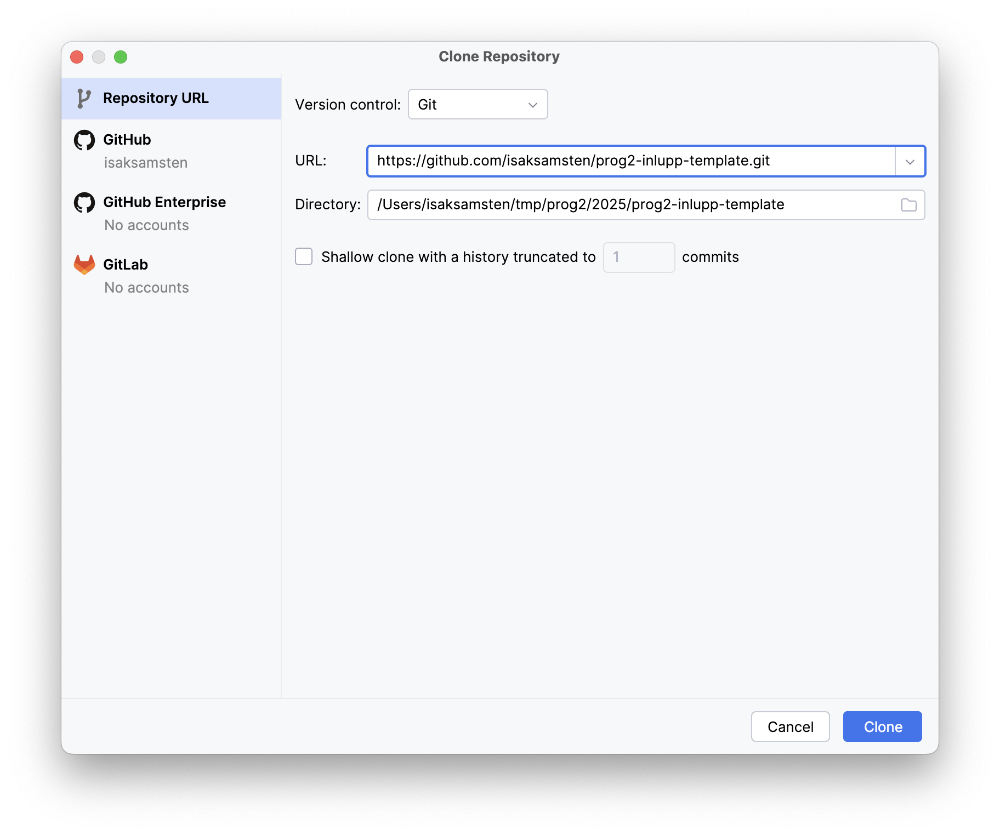
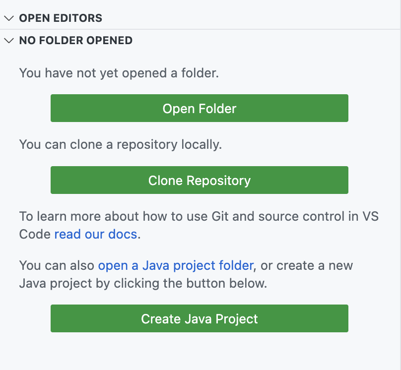

# Template för PROG2 Inlupp 1 och 2

## Instruktioner

Instruktioner finns i iLearn

## Bygg och testa Inlupp 1 och kör Inlupp 2

```bash
./mvnw package
```

(ersätt `./mvnw` med `mvnw.bat` på Windows`

För att testa JavaFX innan Inlupp 1 är klar:

```bash
./mvnw package -Dmaven.test.skip
```

## Bygg och testa enbart Inlupp 1

```bash
./mvnw compile test -pl backend
```

## Importera i din editor

### Intellij IDEA

Välj File -> New -> Project From Version Control och skriv in https://-url:n
till det här repot.



Det finns tre bygg/kör alternativ. Klicka på dem för att köra projektet.

### Visual Studio Code

Klicka på Clone Repository och fyll i https://-url:n till det här repot.



Kör genom att klicka på Terminal -> Run Build Task...

Testa Inlupp 1 genom att klicka på test under Maven -> backend.
